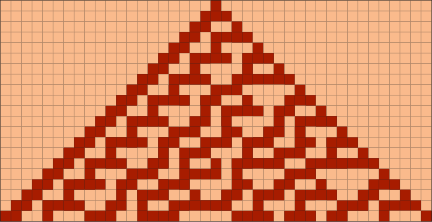

# CellularAutomata

Raku package for representation and evolution of [cellular automata](https://mathworld.wolfram.com/CellularAutomaton.html).

------

## Installation

From Zef ecosystem:

```
zef install CellularAutomata
```

From GitHub:

```
zef install https://github.com/antononcube/Raku-CellularAutomata.git
```

----

## Usage examples

Two steps of [Rule 30](https://en.wikipedia.org/wiki/Rule_30) over a specified array:

```raku
use CellularAutomata;

cellular-automaton(30, [1, 0, 0, 0, 0, 0], 2)
```

Four steps of initialization specification:

```raku
.say for cellular-automaton(30, [[1,], 0], 4)
```

Show the table of rule `90`;

```raku
rule-table(90, method => Whatever); # method takes also 'text' and 'html' 
```

Show rules of rule 90:

```raku
use CellularAutomata::Utilities; 
cellular-automaton-from-number(90)
```

Plot the array of 20 steps of [Rule 30](https://en.wikipedia.org/wiki/Rule_30):

```raku, eval=FALSE
use Graphviz::DOT::Chessboard;

my @mat = cellular-automaton(30,[[1,], 0], 20);
dot-matrix-plot(@mat, :9graph-size, :0tick-font-size, :0tick-offset):svg
```



For more examples see the Jupyter notebook ["CellularAutomaton.ipynb"](./docs/CellularAutomaton.ipynb).

----

## References

[Wk1] Wikipedia entry, ["Cellular automaton"](https://en.wikipedia.org/wiki/Cellular_automaton).

[WRI1] Wolfram Research, Inc., 
[CellularAutomaton](https://reference.wolfram.com/language/ref/CellularAutomaton.html), 
(2002 introduced, 2017 last update), 
[Wolfram Language & System Documentation Center](https://reference.wolfram.com/language/)